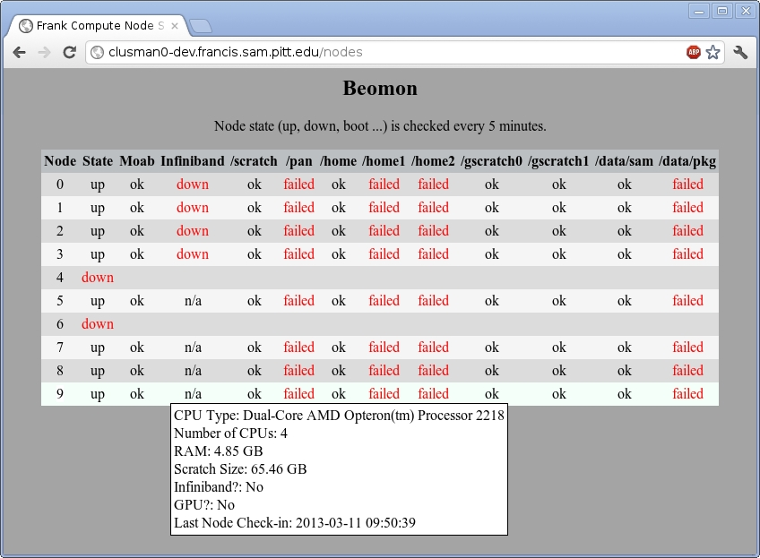

Beomon
======

Beomon is an application used to monitor the status of compute nodes in a
Beowulf-style cluster and create a Web interface to view the status of the
nodes.  Specifically this supports the University of Pittsburgh's HPC 
cluster "Frank".  This software adds two node states not available in 
the standard Scyld/Beowulf install: orphaned and partnered.

"Orphaned" means that the compute node is still alive and checking into
the back-end database (or at least has in the past 10 minutes).  This is
needed to support Scyld's "run to completion" feature.  When a compute 
node is first seen in the state "orphan" Beomon's master agent will
prevent new jobs from being scheduled on the node.  Similarly when
the node is first seen in the state "up" jobs scheduling will be
enabled for the compute node.

"Partnered" means that the compute node is under the control of another
master node.  This is needed to support Scyld's active-active master
configuration.  For example with master nodes head0a and head0b both configured
to be a possible master of node 10, one master will consider the node 
"partnered" while the other in control of the compute node considers
it up, down, boot or error.  Otherwise both masters consider it down
or orphaned when no master is in control.

[]

License
-------

This software is released under version three of the GNU General Public License (GPL) of the
Free Software Foundation (FSF), the text of which is available at http://www.fsf.org/licensing/licenses/gpl-3.0.html.
Use or modification of this software implies your acceptance of this license and its terms.
This is a free software, you are free to change and redistribute it with the terms of the GNU GPL.
There is NO WARRANTY, not even for FITNESS FOR A PARTICULAR USE to the extent permitted by law.

Installation
------------

Beomon utilizes a MySQL (or compatible) database.  These instructions are for
RHLE6/CentOS6 and assumes /opt/sam is available to all nodes.  Any Web server
capable of running a python script should work.

### Prepare the database
* `yum install mysql-server mysql MySQL-python`
* `rsync -Pah /usr/lib64/python2.6/site-packages/MySQLdb /opt/sam/beomon/modules/`
* `rsync -Pah /usr/lib64/python2.6/site-packages/_mysql* /opt/sam/beomon/modules/`
* `echo 'somepass' > /opt/sam/beomon/beomonpass.txt`
* `chmod 600 /opt/sam/beomon/beomonpass.txt`
* `service mysqld start`
* `/usr/bin/mysql_secure_installation`
* `mysql> CREATE DATABASE beomon;`
* `mysql> GRANT ALL PRIVILEGES ON beomon.* TO 'beomon'@'10.54.50.%' IDENTIFIED BY 'somepass';`
* `mysql> GRANT ALL PRIVILEGES ON beomon.* TO 'beomon'@'%.francis.sam.pitt.edu' IDENTIFIED BY 'somepass';`
* `mysql> FLUSH PRIVILEGES;`
* `mysql> USE beomon;`
* `mysql> CREATE TABLE beomon (node_id INT NOT NULL UNIQUE KEY PRIMARY KEY, state VARCHAR(50), state_time BIGINT, `
`moab VARCHAR(50), infiniband VARCHAR(50), tempurature VARCHAR(50), scratch VARCHAR(50), panasas VARCHAR(50), `
`home VARCHAR(50), home1 VARCHAR(50), home2 VARCHAR(50), home3 VARCHAR(50), home4 VARCHAR(50), home5 VARCHAR(50), `
`gscratch0 VARCHAR(50), gscratch1 VARCHAR(50), gscratch2 VARCHAR(50), gscratch3 VARCHAR(50), gscratch4 VARCHAR(50), `
`gscratch5 VARCHAR(50), datasam VARCHAR(50), datapkg VARCHAR(50), cpu_type VARCHAR(100), cpu_num INT, gpu BOOL, `
`scratch_size VARCHAR(50), ram VARCHAR(50), serial VARCHAR(50), last_check BIGINT);`

### Configure Apache httpd

* `yum install httpd`
* Add "LoadModule cgi_module modules/mod_cgi.so" to the configuration
* Add "ScriptAlias /nodes /path/to/cgiroot/beomon_display.py" to the configuration
* Ensure the user httpd runs as can execute the program
* Go to http://your.web.server/nodes

### The programs

beomon_master_agent.py is ran on the master/head node of the cluster.  This 
program checks the status (up, down, boot, error) of compute nodes and 
updates the database.  Pass a string to the -n flag of which nodes to check.

Example: `beomon_master_agent.py 0-5,7-9`

beomon_compute_node_agent.py is ran on each compute node and check the status
of Infiniband, mount points, CPU/system temperature, etc.  It can be ran via
the master/head node with:

`beorun --all-nodes --nolocal beomon_compute_node_agent.py`

However, it is designed to be started in daemon mode on each compute node as they boot
with `99zzzbeomon`.  Note that in daemon mode the health is only checked once.  From then 
on every 5 minutes it will only update the DB saying it checked in.

99zzzbeomon is a Beowulf init script.  Place is in /etc/beowulf/init.d and make it executable.
Compute nodes should run it when they boot or you can run it by hand with an argument of which
node you want to run it on.

beomon_display.py is a CGI script to be ran by a Web server.  This will display a table of the
current ststus of each node.  Hover over the node number to see the node's details (CPU type, RAM 
amount, etc.).

beomon_statsgen.py will pull the node details (CPU type, RAM amount, etc.) out of the DB, create 
a CSV of these details then print the totals for the cluster.

Example: `beomon_statsgen.py`
